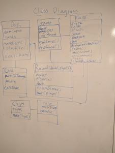
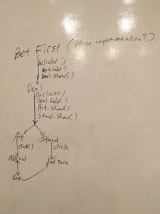
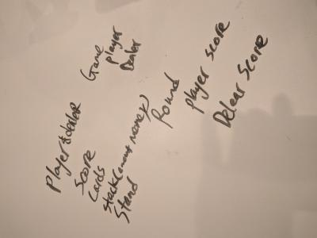
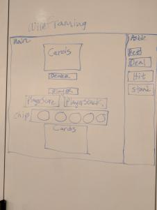

# Blackjack
Blackjack game on the web that is hosted on an Ubuntu Web Server. Testing have only been done on Google Chrome, Firefox, and Internet Explorer

## Technologies and Frameworks Used
#### **Bootstrap**
#### **Ubuntu 18.04.2 LTS Web Server**
#### **JQuery**
#### **Javascript, HTML, CSS**

## Tools Used
#### ZenHub
<https://www.zenhub.com/>
#### ReText
<https://github.com/retext-project/retext>

## Prerequisites
- Most recent versions of Firefox or Google Chrome
- Some JQuery functionality might not work for Internet Explorer

## Whiteboarding

## Wireframe

## Game Link
<http://linproject1.ddns.net/Blackjack/>

## Project Board
### Github Issues
<https://github.com/DjMikeLin/Blackjack/issues>
### Zenhub
<https://app.zenhub.com/workspaces/workplace-5cae068afde3c3357e3c2d73/board?repos=180606556>

## Image References:
### Blackjack Board Background Image
<http://cheerspokernh.com/wp-content/uploads/2018/02/bigstock-poker-table-background-26587844-2-1.jpg>
### Full Deck Images
<http://acbl.mybigcommerce.com/52-playing-cards/>
### Poker Chips Images
<https://www.pokerchips.com/monte-carlo-1000-yellow-clay-poker-chips>